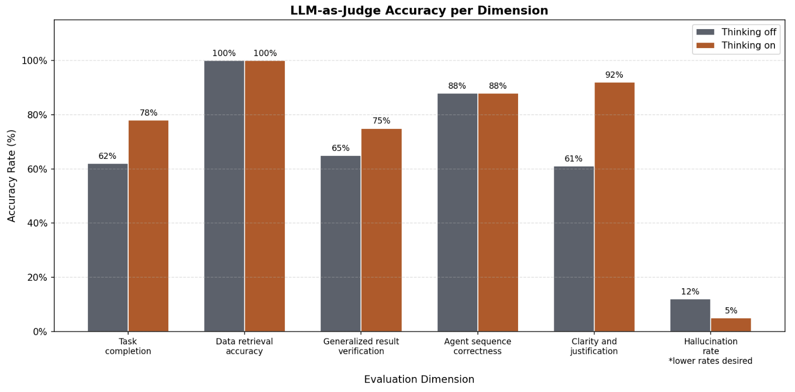

# HPML Final Project: Profiling and Optimizing the AssetOpsBench Plan-Execute Pipeline

*Note: The original README for AssetOpsBench can be found at [README_AssetOpsBench.md](README_AssetOpsBench.md)*

> **Course:** High Performance Machine Learning\
> **Semester:** Spring 2026\
> **Instructor:** Dr. Kaoutar El Maghraoui

---

## Team Information

- **Team Name:** Team 21
- **Members:**
  - Shen Li (sl6008) — [@jasonlee-1024](https://github.com/jasonlee-1024) — *Profiling script, thinking mode integration*
  - Charles Xu (tx2263) — [@Char15Xu](https://github.com/Char15Xu) — *Thinking mode classifier training, model-based router*
  - Ann Li (acl2246) — [@anncli](https://github.com/anncli) — *Rule-based router, updated proposal for mentor project resubmission, general documentation & reports*
  - Caroline Cahill (clc2240) — [@caroline-cahill](https://github.com/caroline-cahill) — *Data preparation (label data with llm), trained thinking mode classifier on labeled data, W&B logging, presentations*

## Submission

- **GitHub repository:** [https://github.com/jasonlee-1024/AssetOpsBench](https://github.com/jasonlee-1024/AssetOpsBench/tree/main)
- **Final report:** [`deliverables/HPML_Final_Report.pdf`](deliverables/HPML_Final_Report.pdf)
- **Final presentation:** [`deliverables/HPML_Final_Presentation.pdf`](deliverables/HPML_Final_Presentation.pdf)
- **Experiment-tracking dashboard:** [https://api.wandb.ai/links/ccahill19-columbia-university/pi21cc6x](https://api.wandb.ai/links/ccahill19-columbia-university/pi21cc6x)

The final report PDF and the presentation file are checked into the `deliverables/` folder of this repository **and** uploaded to CourseWorks.

---

## 1. Problem Statement

This project provides the first systematic performance characterization of the AssetOpsBench plan-execute pipeline. By comparing Gemma 4 26B with and without thinking mode, we quantify the latency and accuracy tradeoff of whether thinking mode is worthwhile for industrial asset operations tasks. We identified the planning phase of the inference as the main bottleneck when thinking mode is enabled. To optimize, we implemented a rules-based router and a DistilBERT Classifier to label and route complex tasks to a thinking-enabled planner and simple tasks to a standard planner to balance the latency-accuracy tradeoff.

---

## 2. Model/Application Description

Briefly describe the model(s) and stack you used:

- **Model architecture:** Google Gemma 4 26B (thinking vs. non-thinking), AssetOpsBench's Plan-Execute Pipeline as agent
- **Framework:** PyTorch 2.4.0, vLLM 0.19.0 as the inference server, CUDA 12.4, and Python 3.11
- **Dataset:** We used the [AssetOpsBench dataset from IBM Research](https://huggingface.co/datasets/ibm-research/AssetOpsBench) with an Apache 2.0 license. We used the train split of the “scenarios” subset containing 152 scenarios. We selected 40 scenarios for profiling.
- **Custom layers or modifications:** Our profiling and optimizations are modular and directly builds on-top of the upstream AssetOpsBench repository for clean open-source contribution.
- **Hardware target:** NVIDIA A100 GPU


---

## 3. Final Results Summary

| Metric                          | Always Off | Rule    | Model   | Always On |
| ------------------------------- | ---------- | ------- | ------- | --------- |
| Time                            | 15.082s    | 17.107s | 17.345s | 18.323s   |
| Task Completion                 | 62%        | 70%     | 73%     | 78%       |
| Data Retrieval Accuracy         | 100%       | 100%    | 100%    | 100%      |
| Generalized Result Verification | 65%        | 68%     | 71%     | 75%       |
| Agent Sequence Correctness      | 88%        | 88%     | 88%     | 88%       |
| Clarity & Justification         | 61%        | 82%     | 85%     | 92%       |
| Hallucination Rate.             | 12%        | 9%      | 7%      | 5%        |

**Hardware:** 1× NVIDIA A100 80 GB SXM4 (RunPod), PyTorch 2.4.0, vLLM 0.19.0, CUDA 12.4, and Python 3.11

**Headline result (one sentence):** *Using a classifier model to route scenarios saved 5.64% of latency overhead while only dropping 5 pp accuracy in task completion, while a rule-based router saved 7.11% latency at the cost of 8pp drop in task completion.*

---

## 4. Repository Structure

```
.
├── README.md
├── README_AssetOpsBench.md       # Original upstream AssetOpsBench README
├── LICENSE
├── pyproject.toml                # Project dependencies and console entry points
├── uv.lock                       # Reproducible Python dependency lockfile
├── deliverables/                 # Final report and presentation submitted to CourseWorks
│   ├── HPML_Final_Report.pdf
│   └── HPML_Final_Presentation.pdf
├── scripts/                      # Profiling and latency evaluation
│   └── bench_latency.py
├── src/
│   ├── agent/                    # Plan-execute agent with router integration (optimized pipeline)
│   ├── workflow/                 # Baseline plan-execute runner with a direct thinking: bool flag
│   │   ├── runner.py             # PlanExecuteRunner (thinking on/off for always-on/always-off baselines)
│   │   ├── planner.py            # Planner with optional thinking-mode prompt injection
│   │   ├── executor.py           # MCP tool dispatcher
│   │   ├── models.py             # Shared data models (Plan, PlanStep, OrchestratorResult)
│   │   ├── cli.py                # plan-execute-workflow entry point
│   │   └── tests/                # Unit tests for workflow components
│   └── llm/
│       ├── lmtrain.py            # DistilBERT model-router training and inference CLI
│       ├── rule_based_router.py  # Deterministic rule-based thinking router
│       ├── router_demo.py        # Combined rule/model router visualization demo
│       ├── rule_based_router_keywords.yaml
│       ├── base.py               # Shared LLM backend interface
│       ├── litellm.py            # LiteLLM backend with thinking-mode support
│       └── test_*.py             # Router and training unit tests
├── results/
│   ├── figures/base_accuracies.png
│   └── dashboard/DistilBERT Classifier Training Weights & Biases Report.pdf
└── docs/guideline/               # Upstream scenario and ground-truth design guides
```

---

## 5. Reproducibility Instructions

### A. Environment Setup

```bash
# Clone and enter the repository.
git clone https://github.com/jasonlee-1024/AssetOpsBench.git
cd AssetOpsBench

# Recommended: use the checked-in pyproject.toml and uv.lock.
uv sync --extra dev --extra train
source .venv/bin/activate

# Pip fallback if uv is unavailable.
python3.12 -m venv .venv
source .venv/bin/activate
pip install -U pip
pip install -e ".[dev,train]"
```

**Environment choice:** The root `pyproject.toml` is the source of truth for this project, and `uv.lock` provides the reproducible Python lockfile. A separate Conda environment is not required. Use Conda only if your machine needs Conda-managed CUDA/PyTorch packages; still install this repository from `pyproject.toml` inside that environment.

**System requirements:** Python 3.12, CUDA 12.x for GPU-backed training/inference, and an NVIDIA A100-class GPU for reproducing the reported Gemma/vLLM experiments. CPU is sufficient for the rule-based router demo.

**Optional TSFM dependency:** The TSFM server imports IBM Granite TSFM lazily. Install it only when running TSFM tools:

```bash
pip install git+https://github.com/ibm-granite/granite-tsfm
```

### B. Experiment Tracking Dashboard

Public experiment-tracking dashboard with training and evaluation metrics, system profiling, and baseline vs. optimized comparisons:

> **🔗 Dashboard:** [https://wandb.ai/ccahill19-columbia-university/hpml-semester-project/reports/HPML-Semester-Project-Classifier-Training-Run--VmlldzoxNjcxNzY3Ng?accessToken=2uqguvqiwavm74krgbytv60mw8ytlc8m8d770933wessmzm8mbghoiwkakajy1p8](https://wandb.ai)
>
> *Platform used:* [Weights & Biases / MLflow / TensorBoard / Comet / Neptune / other]

Verify the link opens in an incognito browser. The dashboard includes a curated **report** that walks through the optimization story. If your platform does not support public links (e.g., self-hosted MLflow), a static export is committed under `results/dashboard/` instead.

### C. Dataset

```bash
# AssetOpsBench scenarios are available from Hugging Face.
# The router training script expects JSONL rows:
# {"text": "...", "label": "true"} or {"text": "...", "label": "false"}
mkdir -p data
# Save the labeled router-training file as:
# data/lmtrain_data.jsonl
```

The AssetOpsBench dataset is available at https://huggingface.co/datasets/ibm-research/AssetOpsBench. The labeled router-training file is not committed because it is generated from the project labeling workflow.

### D. Training

Train the model-based thinking router:

```bash
train-lmtrain
# Equivalent module form:
python -m llm.lmtrain
```

By default, this reads `data/lmtrain_data.jsonl`, trains a DistilBERT binary classifier, writes the model to `models/lmtrain`, and writes evaluation metrics to `models/lmtrain/eval_metrics.json`.

To run the model-router demo after training:

```bash
train-lmtrain --demo
# The CLI also accepts the project-requested spelling:
train-lmtrain -demo
```

### E. Evaluation

```bash
train-lmtrain --route "Detect bearing faults in WT-105"
rule-router --route "Detect bearing faults in WT-105"
```

### F. Profiling

To regenerate the latency comparison used in the report:

```bash
python scripts/bench_latency.py --help
```

### G. Visualize the Rule-Based and Model-Based Routers

Run the deterministic rule-based router demo:

```bash
rule-router --demo
rule-router -demo
```

Run the trained model-based router demo:

```bash
train-lmtrain --demo
train-lmtrain -demo
```

Run both demos in one combined visualization:

```bash
router-demo --demo
router-demo -demo
```

---

## 6. Results and Observations

A short narrative (3–6 bullets) summarizing what you found. Include 1–2 representative figures from `results/` directly in this README so a reader gets the gist without opening Wandb.

- *Thinking vs. Non-Thinking Mode Latency:* 21.5% more end-to-end latency (+3.241s per scenario on average) with reasoning/thinking mode turned on.
- *Bottleneck is in the Planning Phase:* 41.9% increase in latency in the planning phase (+2.767s) with thinking mode turned on.
- *Rule-Based Routing:* recovers most of the accuracy lost without always-on while cutting 1.216s off always-on latency, with the benefit of zero LLM overhead at routing time.
- *Classifier Model Routing:* higher accuracy than rule-based across four accuracy dimensions at the cost of only +0.238s additional latency.
- *What did not work:* Neither routing strategy fully closes the accuracy gap compared to always-on reasoning. Due to time and resource constraints trained scenarios are LLM-labeled as simple or complex for classifier router training, which may not be as accurate as labels from actual profiling results leading to sub-optimal accuracy.


---

## 7. Notes

- Source files live under `src/`, configuration under `configs/`, and scripts under `scripts/`.
- Trained checkpoints are stored in [GitHub Releases / Hugging Face Hub / external bucket] — see `docs/checkpoints.md`.
- All secrets (API keys, Wandb tokens) are loaded from environment variables. See `.env.example`.

### AI Use Disclosure

*Per the HPML AI Use Policy (posted on CourseWorks). Required for every submission.*

**Did your team use any AI tool in completing this project?**

- [ ] No, we did not use any AI tool.
- [x] Yes, we used AI assistance as described below.

**Tool(s) used:** ChatGPT, Claude

**Specific purpose:** Clarifying concepts (vLLM thinking-mode internals, DistilBERT fine-tuning, MCP protocol); debugging runtime errors (CUDA OOM during classifier training, CouchDB connection handling, MCP stdio transport issues); polishing prose in the report and README; and assisting with Git workflows (branch management, resolving merge conflicts).

**Sections affected:** `src/llm/lmtrain.py` (training loop debugging), `src/llm/rule_based_router.py` (keyword pattern refinement), `scripts/bench_latency.py` (threading and timeout fixes), `src/llm/test_rule_based_router.py` (sample scenarios for unit tests), README (this disclosure), report §III Methodology, §V Discussion, and formatting.

**How we verified correctness:** Re-ran all reported experiments ourselves and confirmed numbers match the W&B dashboard; reviewed every AI-suggested code change line-by-line before committing; all router unit tests pass on the final codebase.

By submitting this project, the team confirms that the analysis, interpretations, and conclusions are our own, and that any AI assistance is fully disclosed above. The same disclosure block appears as an appendix in the final report.

### License

Released under the MIT License. See [`LICENSE`](LICENSE).

### Citation

If you build on this work, please cite:

```bibtex
@misc{teamname2026hpml,
  title  = {[Profiling and Optimizing the AssetOpsBench Plan-Execute Pipeline]},
  author = {Li, Shen and Xu, Charles and Li, Ann and Cahill, Caroline},
  year   = {2026},
  note   = {HPML Spring 2026 Final Project, Columbia University},
  url    = {https://github.com/jasonlee-1024/AssetOpsBench/tree/main}
}
```

### Contact

Open a GitHub Issue or email *[sl6008@columbia.edu]*.

---

*HPML Spring 2026 — Dr. Kaoutar El Maghraoui — Columbia University*
